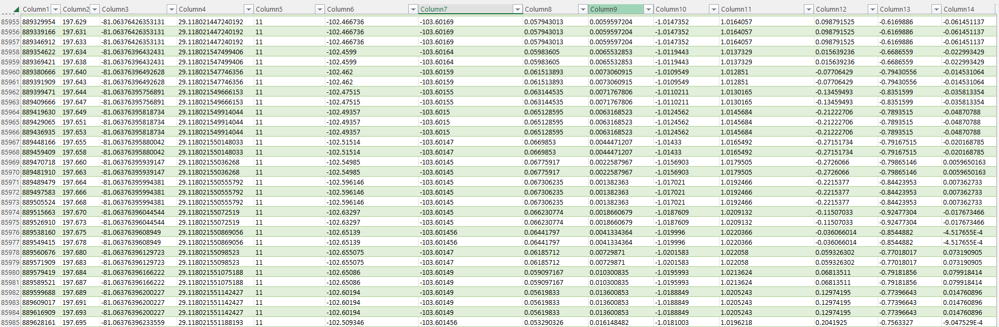

**DatCon**
===========

**What is DatCon**

DatCon is a tool written in java that can convert compressed files saved in
dat format into readable characters. The problem is that the tool is only graphical available. But we need a command tool
Therefore, this must be converted to a command tool

There is already a source that provides a command tool for DatCon. 
(https://www.jetbrains.com/help/idea/compiling-applications.html#package_into_jar)

But there are still some things that need to be adjusted and changed to suit our needs. The data can only be processed further via commands.

In order to make the code executable, the errors must first be fixed. As the project contains some import errors and other coding errors, these need to be fixed.
After the fixes the Code can be used to convert a Dat File to a csv file.

**Concept**

The app for the drones logs the location data and saves it in a dat file. However, these are compressed and must therefore be converted by the tool. Therefore, 
the file is given and Datcon creates a Csv from it. After that, it can be used further or saved in the database

**Why we use DatCon**

Datco is the only tool on the market that can quickly convert compressed data to plain text. It's open source, which is another advantage. It is easy to rewrite and easy to use.

**How it works**

Here are screenshots of what it looks like before and after

Before the data looke like 

.. image:: images/DatCon-File.jpg  

After DatCon transforming the data, the data looks like this

The dacon consists of many classes that need to be modified to build the command line tool we need.
A Jar file is simply created from the end code and the file can then be given. This is then converted and you can use it

The main function is main. In this function the filename is given over 

.. image:: images/DatConmain.jpg

**What to consider**

The hardcoded file name has to be rewritten in order to be able to provide the file dynamically
It is first checked whether args.length is greater than 1 (if no file name is given, it is zero)
Then the file name is given to the createDatFile function. When all imports, coding, and other hardcoded errors are fixed the app can be started

**How can dacon  be executed**

After all problems are gone and it has been rewritten to a command tool one can create a jar file that can be execute.

To convert a file to a csv one only has to use the jar file and submits the file. Then it will convert the data.

.. code-block::

   jar ./Dacton.jar FLY001.dat