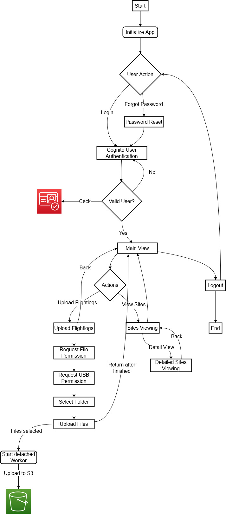
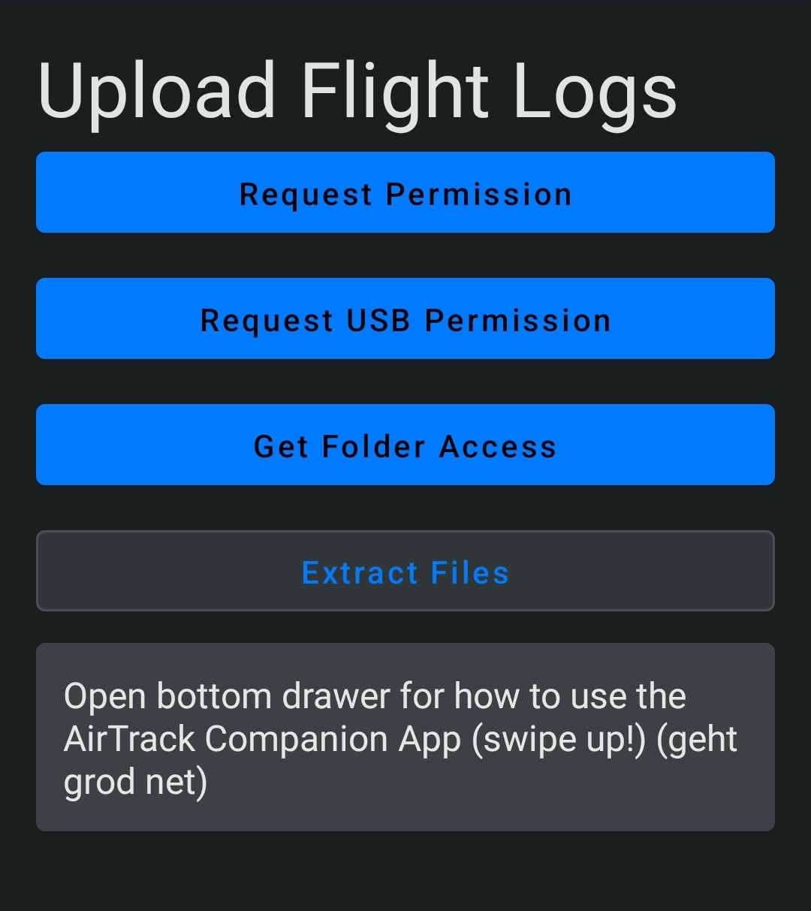

Android App
===========

Overview
--------

This is the AirTrack Companion App for Android. It is written in Kotlin and uses the Android SDK. It is designed to run on Android 11 (API level 30) and above.

The App uses a basic AWS Cognito login to authenticate the user. The user can then see the list of their assigned sites and can also upload flightlogs from the connected DJI Controller to the AWS S3 bucket.

Screens and their functionality
-------------------------------

Login
^^^^^

To authenticate users the app uses AWS Cognito. The user can either sign up or sign in.

.. TODO: Lukas Part

List of assigned sites
^^^^^^^^^^^^^^^^^^^^^^

.. TODO: Paul's Part

**Concept**

It should be bulit an android app which show the sites for every pilot.
The data is transferred via the api, which is then processed further in android
The api accesses the mongdb. This data is then output. If one press on a location one will redirect to  another screen with a more detailed overview

.. image:: images/Android-sites-chart.jpg

The data comes from the Mongodb database. This data is retrieved via an API. To get the data from the api we use retrofit. It allows the data to be preserved. Once received the data will be displayed.

**What is retrofit**

Retrofit is a type-safe HTTP client used to retrieve, update, and delete the data from web services. 

One just need to provide the URL and then one can get the data from the API. 

For example our api-url is

   private const val BASE_URL = "https://98j8m82ij0.execute-api.eu-central-1.amazonaws.com/production/"

If we now want to retrieve data we only use the retrofit get function to get the data

   @GET("record_by_so_nr/{id}")

Then the Data can be used.

   suspend fun getItemById(@Path("id") select: Int): List<JsonEntry>

**The output**

The first Screen is the sites Screen. This screen shows the sites that are assigned to the person.
Every person can see the address and other important informations from their assigned sites.

For example 

.. image:: images/android-sites.jpg

If one press the surface it will take the user to another screen that shows more detailed information.

For example

.. image:: images/android-sites-1.jpg

The list is much longer that this

**How it works**

Put simply, the data is received from the API via retrofit. This data is then processed in the viewmodel. Since 
the number of pages varies from user to user, everything has to work dynamically. For this reason we use a lazy column that fills the data into the screen. Pressing the screen takes you to the the nexts screen. 
The ID of the site is given so that it can be queried again with the api. The data is then displayed, this time detailed

Upload flightlogs
^^^^^^^^^^^^^^^^^

Permissions
'''''''''''

The user can upload flightlogs from the connected DJI Controller to the AWS S3 bucket. 
To achieve this the app needs a view permissions from the user.

* ``Manage External Storage``
* ``Read External Storage``
* ``Write External Storage``
* ``Access Internet``
* ``Intent for USB Device Attached``

Workflow
''''''''

At first the user needs to set the permissions. This is done by clicking on the button "Request Permission". In a future release this will be handled during the onboarding process.

To upload the flightlogs the user has to connect the DJI Controller to the Android device via USB. If the device is connected a dialog will pop up asking the user to select the process that can access the app. **Select MTU** and click on **Always**. This will allow the app to access the connected DJI Controller via the system file browser.

Next up is the request for the USB permission. This is done by clicking on the button "Request USB Permission". The user has to grant the permission in the upcoming dialog.

To select the folder where the flightlogs are stored the user has to click on the button "Get Folder Access". This will open the system file browser. The user has to navigate to the folder where the flightlogs are stored and select it.

By clicking on the button "Extract Files" the upload process will start. This will trigger a worker background process that will extract the flightlogs from the selected folder and upload them to the AWS S3 bucket.

The Worker
''''''''''

.. epigraph::

    "A class that performs work synchronously on a background thread provided by WorkManager."

    --  `Android Developers <https://developer.android.com/reference/androidx/work/Worker>`_

**Why do we need a worker?**

The worker is a background process that is triggered (in this case) by the user. It is designed to run in the background for a long time. "A long time" in the Android world means that the process can run longer than 10 minutes. This is called a "long worker".

In older versions of the app this upload process was handed in a coroutine that caused the app to freeze while the upload was running. Due to the size of the the flightlogs the coroutine ran into a timeout and the upload failed. The worker solves this problem by running the upload process in the background.

See also the Android Developer documentation on `Persistent Work <https://developer.android.com/guide/background/persistent>`_ and `Asynchronous Work <https://developer.android.com/guide/background/asynchronous>`_.

.. End