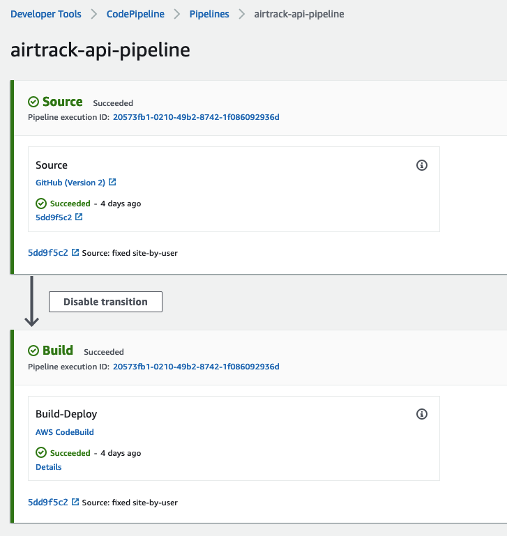
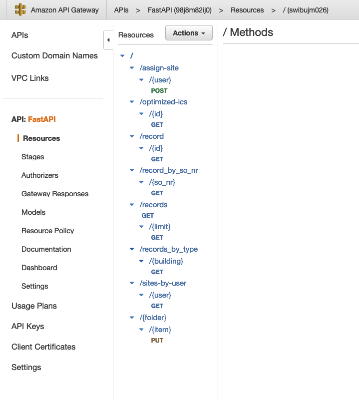
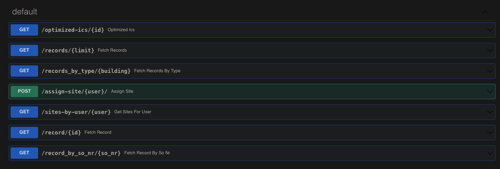

API
===

General
-------

The API (Application Programming Interface) is a set of functions that can be used to interact with the backend of airtrack.
It is used by the webapp and the android-service, but can also be used by other programs to interact with the airtrack backend.

The API is a RESTful API, which means that it is based on the HTTP protocol and uses the HTTP verbs to interact with the backend.

Infrastructure
--------------
The API is based on the FastAPI framework, which is a python framework for building APIs. It is based on the Starlette framework, which is a lightweight ASGI framework. 
The API runs as a Lambda function on AWS, which means that it is serverless and scales automatically. We use Mangum to make the FastAPI application compatible with AWS Lambda.

Like the webapp, the API gets deployed via a AWS Codebuild pipeline. The pipeline is triggered by a push to the master branch of the repository. The pipeline builds the API and deploys it to AWS Lambda.

Using CI/CD makes the deployment of the API very easy and fast. It also makes it possible to have multiple environments, e.g. a staging environment and a production environment.

The API requests are handeld by the API Gateway, which is a service provided by AWS. The API Gateway is responsible for routing the requests to the correct Lambda function. It also handles the authentication of the requests. 

The API Gateway is configured according to the OpenAPI specification, which is a specification for building APIs. The OpenAPI specification is generated automatically by FastAPI.

The complete api specification can be found in the API repository in the file `openapi.json`

Authentication
--------------

To authenticate API requests we use AWS Cognito. Cognito is a service provided by AWS that handles user authentication. It is used by the webapp and the android app to authenticate the users.
Using Cognito makes it possible to have a single sign on for the webapp and the android app. It also reduces the complexity of the authentication process, because we don't have to implement our own authentication system.

Why FastAPI?
------------

As the name suggests, FastAPI is a very fast framework. It is based on Starlette, which is a very lightweight ASGI framework. It is also based on Pydantic, which is a library for data validation and serialization.
FastAPI is also very easy to use and has a lot of features that make it easy to build a RESTful API. It also has a lot of documentation and a very active community.
Using a simple but powerful framework like FastAPI makes it easy to build the API and reduces the complexity of the code.

Compared to other frameworks like Django, FastAPI is very lightweight and has a lot less features. This makes it less complex and easier to use. It also makes it faster, because it doesn't have to load a lot of unnecessary code.

Why AWS Lambda?
---------------

AWS Lambda is a serverless computing service provided by AWS. It makes it possible to run code without having to manage servers. It also scales automatically, which means that it can handle a lot of requests without having to configure anything.
Like almost every service provided by AWS, it makes use of the pay-as-you-go model, which means that you only pay for what you use. This makes it very cost efficient, because you don't have to pay for servers that are not used.
This allows small teams like us to build scalable applications without having to worry about the infrastructure and costs assosiacted with it.

Why Codebuild and not Github Actions?
-------------------------------------

While we started with Github Actions, we switched to Codebuild because it integrates better with AWS.
Also with Github Actions we had to use a third party service to deploy the API to AWS Lambda, which made the deployment process more complex.
With Codebuild we can use the AWS CLI to deploy the API to AWS Lambda, which makes the deployment process a lot easier.

Also Codebuild is a service provided by AWS, which means we can make use of our development credits and don't have to worry about Github Actions minutes and storage.

Why Mangum?
-----------

Mangum is a library that makes it possible to run FastAPI applications on AWS Lambda. It is based on the ASGI specification, which is a specification for building asynchronous web applications.
Without Mangum, FastAPI would not be able to run in AWS Lambda. We would have to write our own code to make it compatible with AWS Lambda, which would be a lot of work and would make the code way more complex.

Why ICS Files?
--------------
ICS files are files that contain calendar events. They are used by a lot of calendar applications, e.g. Google Calendar, Apple Calendar, Outlook, etc.
This cross compatibility makes it possible to import the events into almost every calendar application.
Also most modern cars support importing ICS files, which makes it possible to import the events into the car's navigation system and get directions to the next site.

To create the ics files we use a python library called icalendar. It is a library for creating and parsing ICS files.
