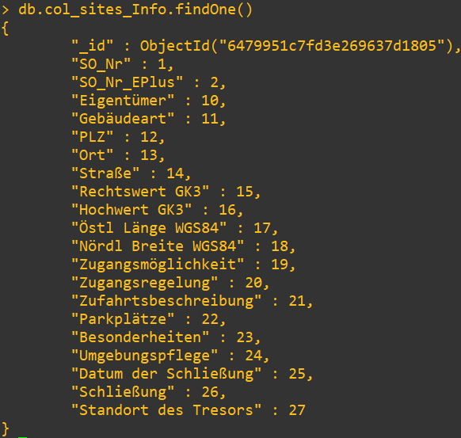
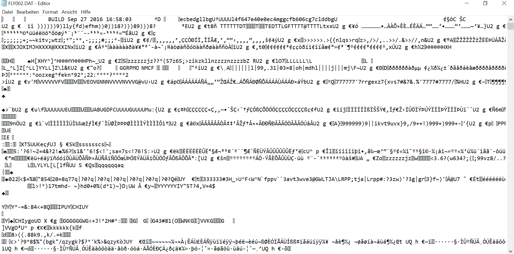
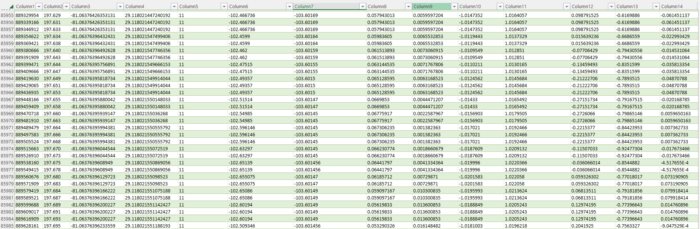
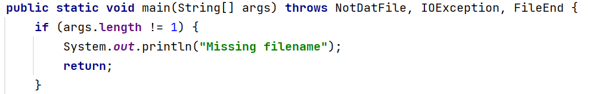
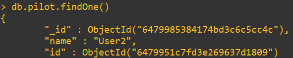
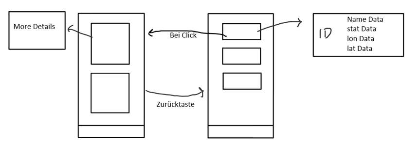
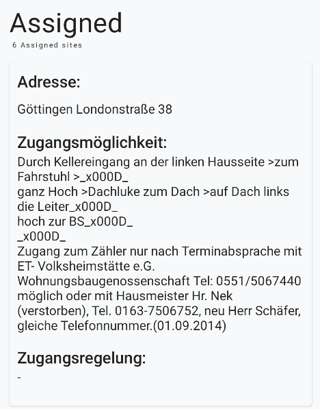
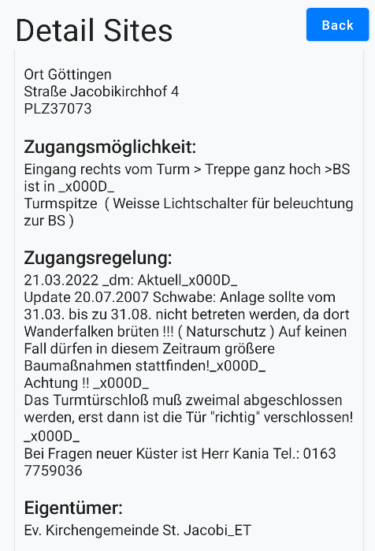

**MongoDB**
-------------

**What is Mongodb**

MongoDB is a document-oriented NoSQL database used for storing, 
querying, and managing data. MongoDB is conceptually different 
from traditional relational databases. 

**The advantages from MongoDB**

- MongoDB stores data in flexible JSON-like documents. 
- It works well with modern applications.
- In addtion it is flexible, scalable and therefore usable for numerous tasks.

**Why we use MongoDB**

We use MongoDB because we need/use the main advantages of scalability and flexibility.
Compared to a MySQL database, we can insert new data more easily. For example if we relanize later
that we need an extra column to store data, it needs to be inserted into each column. In mongoDB, 
it's easier to insert additional data into collections. Also, it's easier to program the API because
It can receive the data without converting it to JSON just like MySQL. The JSON data can then be sent using the API
to Android 

How to install and configurate MongoDB
-------------------------------------------

We use a docker container to deploy a mongoDB database. With a MongoDB container, one can easily set up 
and configure MongoDB without the need for complex installation procedures. It give also the possibility
to get an instance, which deployed fast and easy. Another advantage is that containers are well-suited for 
scaling applications horizontally. Containers enable you to deploy specific versions of MongoDB and ensure that the required libraries and configurations are included

Some steps to run mongoDB in the container

1. Pull the Image: **docker pull mongo** 
2. Start the container: **docker run --name {name} mono -p 27017:27017** (-p we map the container's port 27017 to the host's port 27017).
   
   After this simble steps we have an container that deploy MongoDB.

**What collection we use**
We use a database called airtracked-db, which contains two collections. The first collection named AT_sites_atc stores 
all data from the sites, which are needed later. The second collection At_pilots contain the pilots togehter their assigned sites.

In the first collection one can see the elements. Every element is used. The _id and So_Nr are unique and are very important for the work. For example
the unique id help to find the other information.

Why we need a database
-----------------------

The The data that we will later use in Android and in the Node-JS app comes from an Excel file.
This Excel file contains 40000 entries, all of which must be stored in the database. Since there is no 
converter like in MySQL, one have to write an own script. The script is coded in Python because it is the
simplest language to reach our goal. This script should read the data from exel and write it in the database

**The Concept**

- The script connects to the database
- The data is read from exel.
- The data is then written into the database by exel

**The most important Code**

To connect to Database

   database = MongoClient('mongodb://ip:27017')

Read data from Excel

   df = pandas.read_excel("data.xlsx")

Select Database

   db = database["databasename"]

And wirte the data to Database

   db.collection.insert_many(data)

**DatCon**
===========

**What is DatCon**

DatCon is a tool written in java that can convert compressed files saved in
dat format into readable characters. The problem is that the tool is only graphical available. But we need a command tool,
because §
Therefore, this must be converted to a command tool

There is already a source that provides a command tool for DatCon. 
(https://www.jetbrains.com/help/idea/compiling-applications.html#package_into_jar)

But there are still some things that need to be adjusted and changed to suit our needs. The data can only be processed further via commands.

In order to make the code executable, the errors must first be fixed. As the project contains some import errors and other coding errors, these need to be fixed.
After the fixes the Code can be used to convert a Dat File to a csv file.

**Concept**

The app for the drones logs the location data and saves it in a dat file. However, these are compressed and must therefore be converted by the tool. Therefore, 
the file is given and Datcon creates a Csv from it. After that, it can be used further or saved in the database

**How it works**

Here are screenshots of what it looks like before and after

Before the data looke like 

After DatCon transforming the data, the data looks like this

The dacon consists of many classes that need to be modified to build the command line tool we need.
A Jar file is simply created from the end code and the file can then be given. This is then converted and you can use it

The main function is main. In this function the filename is given over 

**How can dacon  be executed**

To convert a file to a csv one only has to use the jar file and submits the file.
   
   jar ./Dacton.jar FLY001.dat

**Other Script**
================

Another task was tocreate a base script for the API that maps the data to the pilots. The IDs are assigned to the pilots. The pilot can then use this ID
to see what sites are are map to their. 

**How it work**

A user and the so_nr of the function are specified. Then the ID is searched for the SO_nr, which is then used to match it to the pilot. Once assigned, on can search for the pilot and retrieve all IDs
assigned to the pilots. With this ids one can determine the sites.

.. image:: images/sites.jpg

**The most important code**

   def assign_sites(user, so_nr):    
         objects = old_collection.find_one({"SO_Nr": so_nr})
         if objects:
         value = objects['_id']        
         new_collection.insert_one({"name":user,"id":ObjectId(value)}) 

There the user and the id, which was found by so_nr, are stored in the mongodb.

output

In that example a user is assignt to a site by the id.

**Android**
============

**Concept**

It should be bulit an android app which show the sites for every pilot.
The data is transferred via the api, which is then processed further in android
The api accesses the mongdb. This data is then output. If one press on a location one will redirect to  another screen with a more detailed overview

The data comes from the Mongodb database. This data is retrieved via an API. To get the data from the api we use retrofit. It allows the data to be preserved. Once received the data will be displayed.

**What is retrofit**

Retrofit is a type-safe HTTP client used to retrieve, update, and delete the data from web services. 

One just need to provide the URL and then one can get the data from the API. 

For example our url is

   private const val BASE_URL = "https://98j8m82ij0.execute-api.eu-central-1.amazonaws.com/production/"

If we now want to retrieve data we only use the retrofit get function to get the data

   @GET("record_by_so_nr/{id}")

Then the Data can be used.

   suspend fun getItemById(@Path("id") select: Int): List<JsonEntry>

**The output**

The first Screen is the sites Screen. This screen shows the sites that are assigned to the person.
Every person can see the address and other important informations from their assigned sites.

For example 

If one press the surface it will take y to another screen that shows more detailed information.

For example

The list is much longer that this

**How it works**

Put simply, the data is received from the API via retrofit. This data is then processed in the viewmodel. Since 
the number of pages varies from user to user, everything has to work dynamically. For this reason we use a lazy column that fills the data into the screen. Pressing the screen takes you to the the nexts screen. 
The ID of the site is given so that it can be queried again with the api. The data is then displayed, this time detailed

