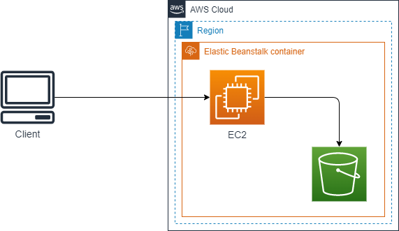
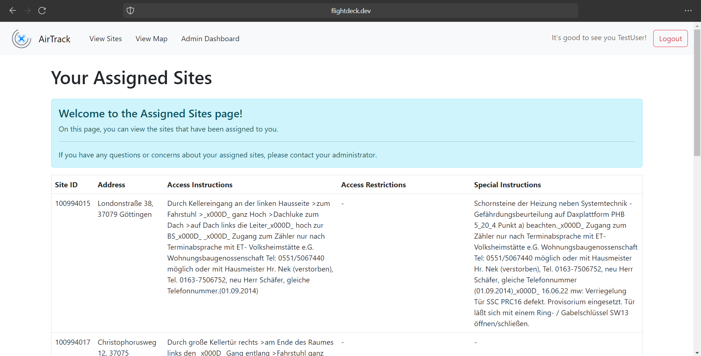
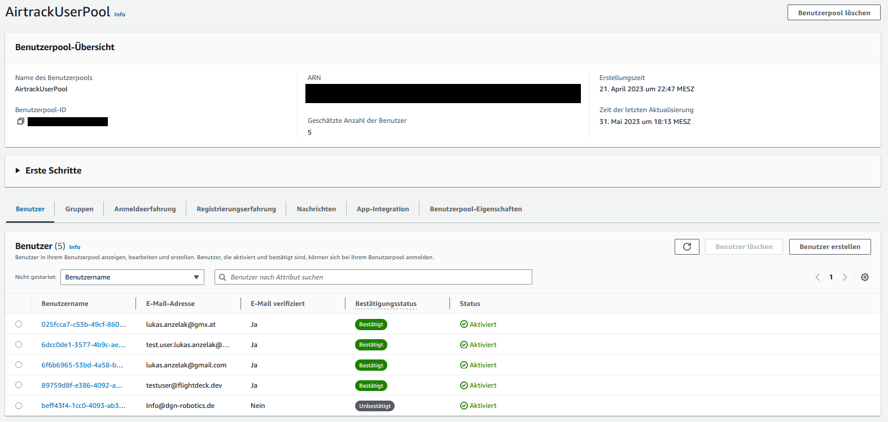
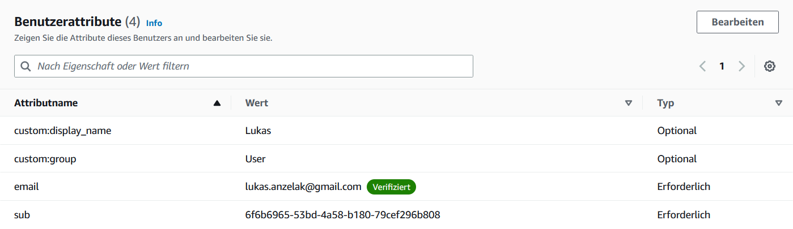
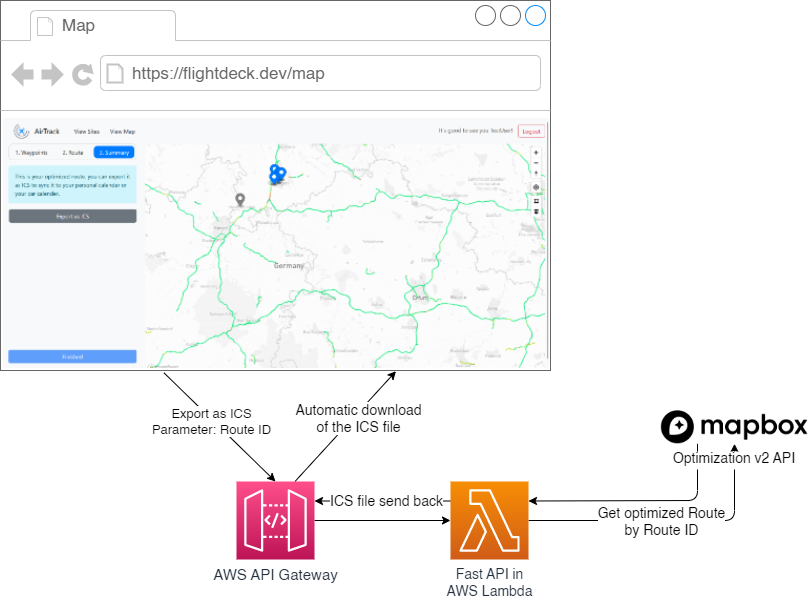
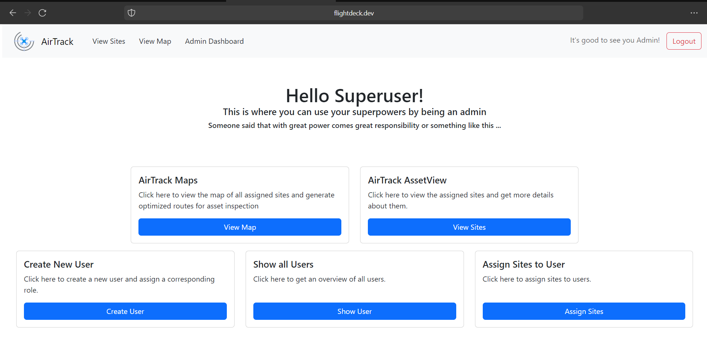
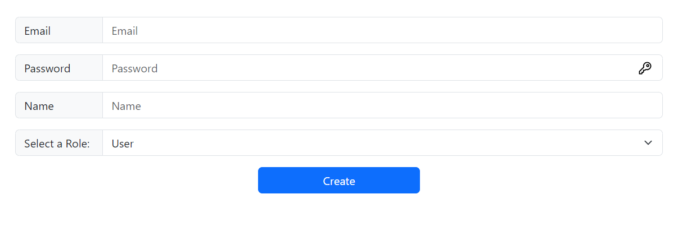
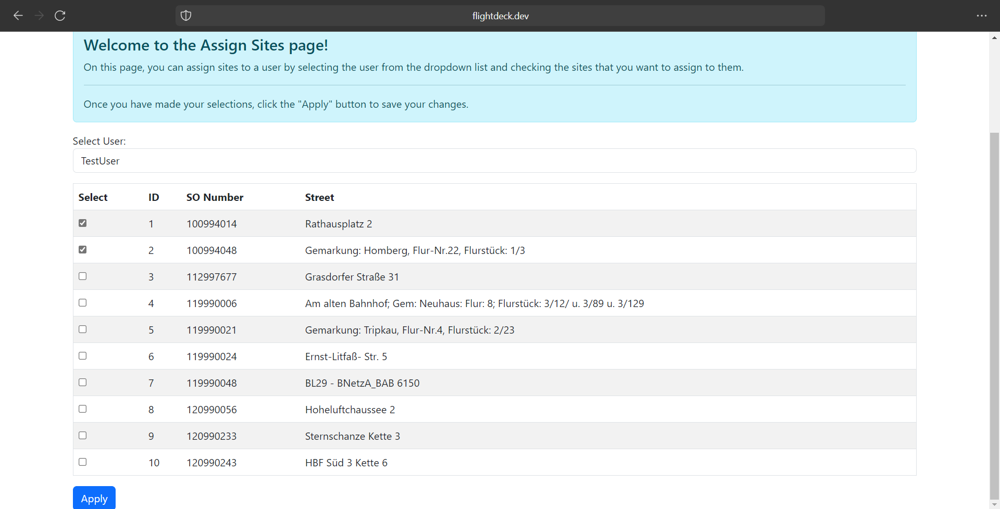
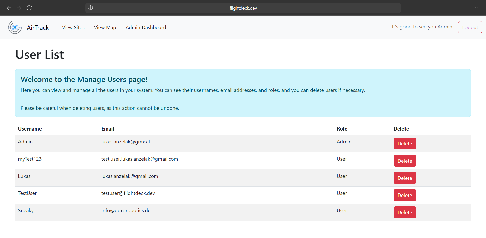

Webapp
=======

General
-------

The webapp is a web interface for viewing, planing, assigning and exporting routes. It is based on Node.js and uses the Mapbox GL JS library for rendering the map and the Mapbox Optimization v2 API for route calculation.
Authentication is done via AWS Cognito. Through this, we are not responsible for the security of the user data.
For design we are using Bootstrap 5.3.0-alpha2. The webapp is hosted on AWS Elastic Beanstalk. The webapp is currently ready for use in a production environment.

Infrastructure
--------------

The webapp is based on a `Node.js <https://nodejs.org/en/>`_ server. The server is responsible for the communication with the database and the communication with the clients. The server is also responsible for the authentication and authorization of the users.

It is hosted inside Elastic Beanstalk on AWS.

It will be extended in the future with two availability zones and a Elastic Load Balancer (ELB) for load balancing and high availability.

Design
------

The design of the webapp is based on Bootstrap 5.3.0-alpha2. Bootstrap is a free and open-source CSS framework directed at responsive, mobile-first front-end web development. It contains CSS- and JavaScript-based design templates for typography, forms, buttons, navigation, and other interface components.

With the help of Bootstrap we can create a responsive design that works on every device. Because Bootstrap is a very popular framework the user is already familiar with the design and can use the webapp without any problems. Due to the sleek, modern design, the webapp is visually appealing and easy to use.

User Login
-----------

The user login is implemented via the Amazon Cloud Service 'AWS Cognito'. Amazon Cognito is an authentication and authorization cloud service commonly used to store user information. With this service, it is simple to **add**, **sign up**, **sign in**, or **authorize users**.
It securely stores user data and handles authentication through multiple social identity providers, supporting multi-factor authentication.
Additionally, there are multiple SDKs available to use AWS Cognito as a federated identity management service, allowing the handling of all traffic over the AWS API or Cloud Console.

AWS Cognito
^^^^^^^^^^^

Why Cognito
'''''''''''

We primarily chose the Amazon Cloud Service, specifically AWS, as our preferred provider over others like Microsoft Azure. One of the key factors influencing this decision was the existing balance we had in our AWS account. Utilizing the funds already available in our account made AWS an attractive and cost-effective option for us.
Another compelling reason for selecting AWS was the remarkably low usage cost associated with AWS Cognito service. This played a significant role in our decision-making process, especially considering our relatively smaller user base. With fewer active users to manage, the cost savings offered by AWS Cognito made it a financially advantageous choice for us.

Furthermore, AWS Cognito, as part of the wider AWS ecosystem, seamlessly integrates with other AWS services, providing a cohesive and comprehensive solution for our cloud infrastructure needs. The ease of integration and the ability to leverage additional AWS services further solidified our decision to opt for AWS as our cloud service provider of choice.

Federated Identity
''''''''''''''''''

To integrate AWS Cognito into our Node.js app, we utilize it as a Federated Identity Management System primarily by accessing the service through the AWS API. This approach enables users to log in to each of our services using the same set of credentials.
It also offers the added advantage of relieving us from concerns about securely storing user data or the risk of data loss in case of server faults.

**Benefits**

- Makes it easy for users by using a simplified login process.
- Provides stronger security using trusted identity providers.
- Centralizes identity management for easier administration.
- Ensures scalability and reliability through AWS infrastructure.
- Boosts developer productivity with ready-to-use features and SDKs.

Cognito integration
'''''''''''''''''''

**User Pools**

Cognito User Pools store the user data required for authentication. Each User Pool provides functions like adding, deleting, and granting access to users. Additionally, every User Pool has a unique identifier and an App Client. The App Client is mostly used for integrating the User Pool into a self-hosted website and using Cognito as a Federated Identity solution.

*Here is an example of what a User Pool looks like:*

**NodeJS Integration**

The following code snippet was used to integrate our AWS Cognito Pool:

.. code-block:: python

    require('dotenv').config({path: __dirname + '../.env'});
    const AWS = require('aws-sdk');
    const AwsCognito = require('amazon-cognito-identity-js');
    AWS.config.update({ 
      region: process.env.AWS_COGNITO_REGION,
      accessKeyId: process.env.AWS_ACCESS_KEY_ID,
      secretAccessKey: process.env.AWS_SECRET_ACCESS_KEY
    });
    const PoolData = {
      UserPoolId: process.env.AWS_COGNITO_USER_POOL_ID,
      ClientId: process.env.AWS_COGNITO_CLIENT_ID
    };
    const CISP = new AWS.CognitoIdentityServiceProvider();
    const AWSPool = new AwsCognito.CognitoUserPool(PoolData);

*Note that this code makes use of the dotenv extension, which reads the required parameters needed for the configuration from a file called '.env'.
We do this mainly to ensure that no secrets are stored in the source code and to enhance security when working with GitHub.*

After implementing that code on top of our configuration file, we can now utilize AWS SDK Cognito functions, including this one:

.. code-block:: python

    function getCognitoUser(email) {
      const userData = { Username: email, Pool: AWSPool };
      return new AwsCognito.CognitoUser(userData);
    }

*This function looks for cognito users in the linked User Pool and return an CognitoUser Object*

NodeJS Session
^^^^^^^^^^^^^^

What is the NodeJS Session Module
'''''''''''''''''''''''''''''''''

The NodeJS module 'express-session' is a middleware that provides session management functionality for applications built with the Express framework.
It allows to create and manage sessions, which are temporary storage areas associated with each client's web browser interacting with the application.

**Functionality**

- Session Initialization: The module is used to initialize sessions in an Express application by configuring various options. These options include the secret key for signing the session ID, session storage mechanism, cookie settings, and more.
- Session Data Storage: The module provides a storage mechanism for session data. By default, session data is stored in memory, but it can be configured to use other storage options like a database or external cache.
- Session Management: With 'express-session,' managing sessions throughout a client's interaction with the application is effortless. It allows setting, retrieving, and deleting session data as needed.

Implementation
''''''''''''''

We implement the Express Session in our NodeJS application using the following code snippet:

.. code-block:: python

    const app = express();
    app.use(session({
      secret: process.env.SESSION_SECRET,
      resave: true,
      saveUninitialized: true
    }));

After initializing the Express Session, it becomes possible to store data for each user individually. For example, this is achieveable by using code like the following:

.. code-block:: python

    app.get('/', async (req, res) => {
      req.session.email = "myuser.example@gmail.com"
      req.session.username = "myUser"
      req.session.save()
    });

The code above utilizes a function that stores user-specific data by saving the username and email in the individual user's session when they visit the root page of the Express app (the landing page when accessing the server via a browser).
This means that whenever the variable 'req.session.username' is accessed and printed for the user, it will always contain the user-specific data, and no other data generated by a different user's session. 

Cognito User Attributes
'''''''''''''''''''''''

Every Cognito user has specific attributes that can be defined when creating a Cognito User Pool.
However, there is also the possibility to define custom attributes. For example, our WebApp utilizes the custom attributes 'display_name' and 'group', which are defined as follows:

Using sessions with Cognito
'''''''''''''''''''''''''''

Now, the function of storing data in Express Sessions is utilized to log in users with Cognito and save additional data of the Cognito users in the user-specific Express Session.
This is accomplished using a function like the following:

.. code-block:: python

    app.post('/login', async (req, res) => {
      let rawSessionData = await cfg.login(req.body.username, req.body.password)
      try {
        if (rawSessionData.statusCode == 400 && rawSessionData.data.code == 'UserNotConfirmedException') {
          req.session.verificationEmail = req.body.username
          req.session.save()
          res.redirect('/verify');
        }
        else {
          req.session.AwsCredentials = rawSessionData.credentials
          let mySession = await cfg.getUserSession(req.session.AwsCredentials)
          req.session.userData = await cfg.getUser(mySession)
          req.session.userName = req.session.userData.userInformation.UserAttributes[3].Value
          req.session.userGroup = req.session.userData.userInformation.UserAttributes[2].Value
          req.session.save()
          res.redirect('/')
        }
      } catch {
        res.send(rawSessionData.data.message)
      }
    });

*In this function, if the user has already verified their email, the Express Session saves their AWS credentials, as well as the custom attributes (as seen in the screenshot above) such as the username and user group (user group represents their access rights).*

User Authorization
^^^^^^^^^^^^^^^^^^

User Login
''''''''''

In our WebApp, not every random internet user is granted access to all web pages. First and foremost, every user must be logged in to gain access.
We ensure this by implementing middleware that is executed before allowing any user to make an reqeust to an webpage:

.. code-block:: python

    const isAuthenticated = (req, res, next) => {
      if (req.session.userName) {
        next();
      } else {
        res.redirect('/login')
      }
    };

*This code snippet checks if a username is stored in the user-specific Express Session. 
As mentioned in the previous code snippet, this variable is set after logging in. Therefore, if the username is not set, the user cannot be logged in and will not be granted access to any webpage.*

This middleware function, which ensures that a user is logged in, is implemented as follows:

.. code-block:: python

    app.get('/', isAuthenticated, (req, res) => {
      res.render('home.ejs', {user: req.session.userName});
    });

Admin Login
'''''''''''

In our WebApp, there are specific features intended for use by admins only, such as the Admin Dashboard. We protect these resources by utilizing the custom attribute 'group.'
Similar to how we check if a user is logged in, the following code snippet checks if the userGroup variable (which is set after login) is equal to 'Admin' before granting access to a webpage. (The userGroup variable can only have two possibilities: 'User' or 'Admin'):

.. code-block:: python

    const isAdmin = (req, res, next) => {
      if (req.session.userGroup == 'Admin') {
        next();
      } else {
        res.status(401).send('Only Administrators are authorized to view this content');
      }
    };

    app.get('/admin-dashboard', isAuthenticated, isAdmin, (req, res) => {
      res.render('admin.ejs', {user: req.session.userName})
    });

*Here the middleware function 'isAdmin,' which verifies if a user is an admin, is implemented in the same way as the middleware function that verifies user login.*

Security Aspects
^^^^^^^^^^^^^^^^

Cognito
'''''''

- **Usernames:** All users stored in the Cognito User Pool are required to log in using a verified email address. We have chosen this approach to avoid the need for mechanisms to check duplicate usernames while ensuring unique names for each user.

- **Verification:** After a new user is created, they must enter a verification code before being able to log in and access the web app's webpages.

- **Password Complexity:** Every Cognito User Pool can specify a specific password policy to enhance security. Our chosen policy requires passwords to be 16 characters long and include at least one number, special character, uppercase letter, and lowercase letter.

WebApp
''''''

To enhance the user experience, we have specified error codes that are displayed to the user, providing them with a better understanding of what went wrong.

- **200** - OK: The operation completed successfully.
- **400** - UserAuth Error: The user is unable to log in.
- **405** - GetUser Error: Unable to fetch user data from Cognito.
- **410** - UserCreate Error: Unable to send data to Cognito while creating a user.
- **415** - UserVerify Error: Unable to send data to Cognito while sending a verification code.
- **420** - UserDeletion Error: Unable to send data to Cognito while deleting a user.
- **425** - Fetch Sites Error: Unable to fetch user data from Cognito.
- **403** - Forbidden: The user does not have the rights to access a resource.

Mapview
--------

The Mapview is intended to be a simple, easy to use, and easy to understand web interface for viewing, planing, assigning and exporting routes.

It is based on Node.js and uses the `Mapbox GL JS <https://docs.mapbox.com/mapbox-gl-js/guides/>`_ library for rendering the map and the `Mapbox Optimization v2 API <https://docs.mapbox.com/api/navigation/optimization/>`_ for route calculation.
The routes can be exported as a ICS file for import into a calendar application. With this way you can use the calendar application of your choice for navigation. Cars (like Tesla) with a calendar integration can also use the calendar for navigation.

The workflow uses a 3 step process:

1. Select the waypoints on the map ba drawing a polygon around them.
2. Generate the route with the Mapbox Optimization v2 API.
3. See the stops and download the ICS file.

Mapbox
^^^^^^^

Why Mapbox?
''''''''''''

For short: Mapbox has a lot of free requests per month and it has more features than Google Maps.

The longer version: Google Maps is the most used map service and it is very good. But it has some disadvantages. A Google Maps object itself (just the map without any id) is free no mather how many loads the map has. But thats where the fun is only starting.
Everything else is billed via the Google Maps Platform. You can try to calculate how much you would pay via the `calculator <https://mapsplatform.google.com/pricing/>`_. There you can see that you "only" have $200 free monthly usage.
For a student project this is a sufficient contingent of free requests. But think a little bit bigger: 28.500 loads only for one SDK is not enough if you want to sell the product. And you also have to calculate the other features like the Geocoding API or the Route API.
So things can get very expensive very fast.

This is where Mapbox comes in. After Google raised the prices for Maps companies switched to Mapbox. And Mapbox has a few advantages over Google Maps. The biggest one is that you get 50.000 free loads per month on the JavaScript SDK alone.
Every API is billed separately and the amount of free requests is significantly higher than Google Maps.
For AirTrack we are also using the `Mapbox Optimization v2 API <https://docs.mapbox.com/api/navigation/optimization/>`_ witch is currently in public beta and therefore free to use. This API is used for calculating routes with a (theoretically) 1000 given waypoints.
It solves the so called "Traveling Salesman Problem" (TSP). Google Maps does not have a similar API. You can find more about the TSP `here <https://en.wikipedia.org/wiki/Travelling_salesman_problem>`_.

Mapbox vs. Google Maps Platform
''''''''''''''''''''''''''''''''

This comparison is based on what we need for AirTrack. Based on this we decided to use Mapbox.

+------------------------------------------------+----------------------------------------+----------------------+
| Features                                       | Mapbox                                 | Google Maps Platform |
+================================================+========================================+======================+
| JavaScript SDK free loads per month            | 50.000                                 | 28,500               |
+------------------------------------------------+----------------------------------------+----------------------+
|| JavaScript SDK $ per 1000 loads per month     || $5 (50.001-100.000 loads per month)   || $7                  |
||                                               || $4 (100.001-200.000 loads per month)  ||                     |
||                                               || $3(200.001-1.000.000 loads per month) ||                     |
+------------------------------------------------+----------------------------------------+----------------------+
| Geocoding API free requests per month          | 100.000                                | 28,500               |
+------------------------------------------------+----------------------------------------+----------------------+
| Route Optimization API free requests per month | Unlimited (because of public beta)     | No API               |
+------------------------------------------------+----------------------------------------+----------------------+
| API & SDK requests billed separately           | Yes                                    | No                   |
+------------------------------------------------+----------------------------------------+----------------------+
| Detailed documentation                         | Yes                                    | Yes                  |
+------------------------------------------------+----------------------------------------+----------------------+
| Support                                        | Only in paid version                   | Only in paid version |
+------------------------------------------------+----------------------------------------+----------------------+
| Custom map styles                              | Yes                                    | Yes                  |
+------------------------------------------------+----------------------------------------+----------------------+
| Offline maps                                   | Yes                                    | No                   |
+------------------------------------------------+----------------------------------------+----------------------+
| Possibility for self-hosting                   | Yes (Mapbox Atlas)                     | No                   |
+------------------------------------------------+----------------------------------------+----------------------+
| Street view                                    | No                                     | Yes                  |
+------------------------------------------------+----------------------------------------+----------------------+
| Easy implementation of dynamic map changes     | Yes                                    | No                   |
+------------------------------------------------+----------------------------------------+----------------------+
| Turf.js integration                            | Yes                                    | No                   |
+------------------------------------------------+----------------------------------------+----------------------+
| **Open Source**                                | **Yes**                                | No                   |
+------------------------------------------------+----------------------------------------+----------------------+

Route Optimization
^^^^^^^^^^^^^^^^^^

What is Mapbox Optimization v2 API?
'''''''''''''''''''''''''''''''''''
It is a beta version of the Mapbox Optimization API. It is currently free to use.

Mapbox defines it as follows:

The Optimization v2 API is an API for calculating efficient plans for vehicles to visit multiple locations. These are commonly known as vehicle routing problems.

The Optimization v2 API enables you to submit vehicle routing problems in the form of routing problem documents describing the number of vehicles in your fleet, locations to be visited, and other constraints that are relevant to your real-world problem. The API returns an optimized solution for your routing problem as a solution document that describes a route plan for each vehicle.

Source: `Mapbox Optimization v2 API <https://docs.mapbox.com/api/navigation/optimization/>`_

What can it do?
''''''''''''''''

If you want to get a optimized route you can send them with a POST request a JSON file with the following information:

.. code-block:: json

    POST /optimized-trips/v2?access_token=TOKEN HTTP/1.1
    Host: api.mapbox.com
    Content-Type: application/json
    { 
        "version": 1,
        "vehicles": [...],
        "services": [...]
    }

This returns a route ID. This ID can be used to get the status or the optimized route itself.

The input supports the following features:

.. code-block:: json

    {
        "version": 1,
        "locations": [...],
        "vehicles": [...],
        "services": [...],
        "shipments": [...]
    }

To get the status of all routes you can send a GET request:

.. code-block:: json

    GET /optimized-trips/v2?access_token=TOKEN
    Content-Type: application/json
    Host: api.mapbox.com

If the status is "complete" you can get the route with the following GET request:

.. code-block:: json

    GET /optimized-trips/v2/{route-id}?access_token=TOKEN
    Content-Type: application/json
    Host: api.mapbox.com

How are we using it?
''''''''''''''''''''

We are using it as it is described above. We are sending a JSON file with the waypoints to the API and get a route ID back.
Because we only have a maximum of 10 waypoints we can wait 15 seconds and then the route optimization is complete. We then get the route with the route ID and display the stops in the Mapview.
When you want to export the route as a ICS file we send the route ID to the ICS export function. The ICS export function then gets the route with the route ID and creates a ICS file with the stops.

More on the ICS export function can be found below section.

ICS Export
^^^^^^^^^^

The ICS export function is a API call to AWS Lambda. It is based on a FastAPI application. The python file is using the iCalender library to create the ICS file.

This call is made at the last step of the Mapview. There the user can see the individual stops and download the ICS file. The ICS file can then be imported into a calendar application of your choice. With this way you can use the calendar application for navigation. Cars (like Tesla) with a calendar integration can also use the calendar for navigation.

How does it work?
''''''''''''''''''

When the button "Export as ICS" is clicked, the route ID of the optimized route is sent to the API. The AWS API Gateway forwards the request to the FastAPI service in a AWS Lambda function. 
The FastAPI service then gets the route ID and makes a GET request to the Mapbox optimization v2 API to get the optimized route. The response is a JSON file with the route information.
After that the FastAPI service then parses the JSON file and creates a ICS file with the iCalender library. The ICS file is then returned to the user and is downloaded automatically.

You can find out more information about this in the `API documentation <https://airtrack.readthedocs.io/en/latest/api.html>`_.

AssetView
^^^^^^^^^

The assigned sites view is a view where the user can see his assigned sites in a list. 

This list shows the following information:

* Site ID
* Address
* Access Instructions
* Access Restrictions
* Special Instructions

Gathering the data is rather easy. We are using a GET request to the API to get the assigned sites. The API returns a JSON object with the assigned sites. We then return the JSON object to the AssetView and display the information in a list.

.. code-block:: javascript

    app.get('/get-sites-of-user', isAuthenticated, (req, res) => {
      let user = req.session.userName;
      //get the sites of the user
      const response = fetch('https://98j8m82ij0.execute-api.eu-central-1.amazonaws.com/production/sites-by-user/' + user)
          .then(response => response.json())
          .then(data => {
            //return the sites
            res.send(data);
          })
          .catch(error => console.error(error));
    });

Admin Dashboard
^^^^^^^^^^^^^^^

If you have the privilege to access the admin dashboard you can access the following features:

* See your assigned sites on the map
* See the assigned sites in a list
* Create a new user
* Assign sites to a user
* Show all users

Mapview and AssetView is the same as described above. Every user can access the Mapview and the AssetView.

Creating a new user
'''''''''''''''''''

To create a new user you have to fill out the form. Most notably the role assignment is important. If you want to create a user with admin privileges you have to select "Admin" in the role assignment dropdown. We are advising to create a new user with user privileges.

Assigning sites
'''''''''''''''

To assign sites to a user you have to select the user in the dropdown and then select the sites you want to assign to the user. You can select multiple sites at once. After you have selected the sites you can click on the "Apply" button to assign the sites to the user.

Show all users
''''''''''''''

Here are all users displayed in a list. You can see the following information:

* Username
* Email
* Role
* Delete (Button)

The most prominent feature is the delete button. If you click on the delete button the user is deleted from the database. This is a permanent deletion and can not be undone.
If you delete a user by accident you have to create a new user with the same username and email address, let the user confirm the account and then assign the sites to the user again.

.. End